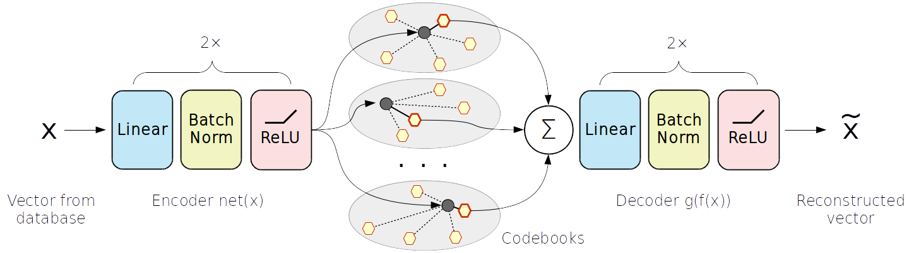

# UNQ
Supplementary Code for Unsupervised Neural Quantization for Compressed-Domain Similarity Search

# What does it do?
It trains a neural network that maps database vectors in 8- or 16-byte codes optimized for nearest neighbor search.

# What do I need to run it?
* A machine with some CPU (preferably 8+) and a GPU
  * Running with no GPU or less than 4 CPU cores may cause premature senility;
* Some popular Linux x64 distribution
  * Tested on Ubuntu16.04, should work fine on any popular linux64 and even MacOS;
  * Windows and x32 systems may require heavy wizardry to run;
  * When in doubt, use Docker, preferably GPU-enabled (i.e. nvidia-docker)

# How do I run it?
1. Clone or download this repo. `cd` yourself to it's root directory.
2. Grab or build a working python enviromnent. [Anaconda](https://www.anaconda.com/) works fine.
3. Install standard compilers (e.g. `gcc` and `g++` for most linux) and `swig3.0`
  * On ubuntu, just `sudo  apt-get -y install swig3.0 gcc-4.9 g++-4.9 libstdc++6 wget unzip`
  * and maybe `sudo ln -s /usr/bin/swig3.0 /usr/bin/swig` for a good measure
4. Install packages from `requirements.txt`, with a little twist
 * FAISS library is hard to install via pip, we recommend using their [anaconda installation](https://github.com/facebookresearch/faiss/blob/master/INSTALL.md#install-via-conda)
 * You will also need jupyter or some other way to work with .ipynb files
5. Run jupyter notebook and open a notebook in `./notebooks/`
 * Before you run the first cell, change `%env CUDA_VISIBLE_DEVICES=#` to devices that you plan to use.
 * First it downloads data from dropbox. You will need up to __1.5Gb__
 * Second, it defines an experiment setup. The setups are:
    * `bigann1m_unq_8b.ipynb` - BIGANN1M dataset, 8 bytes per vector
    * `deep1m_unq_8b.ipynb` - DEEP1M dataset, 8 bytes per vector
    * `bigann1m_unq_16b.ipynb` - BIGANN1M dataset, 16 bytes per vector
    * `deep1m_unq_16b.ipynb` - DEEP1M dataset, 16 bytes per vector

